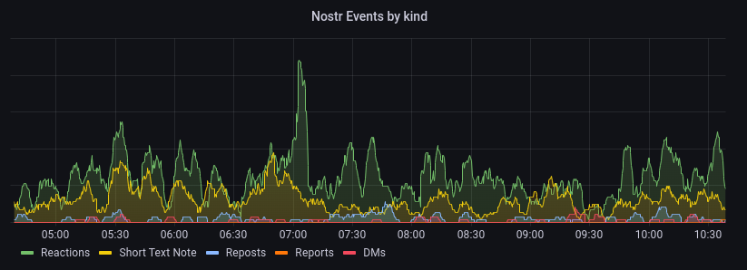

# Prometheus openmetrics for Nostream



A devops component for directly monitoring your [nostream relay](https://github.com/Cameri/nostream), which can be integrated with your self-hosted SRE stack. If you don't have a monitoring system set up already, this won't be useful to you. It's basically a python script that runs Postregsql queries to compile basic metrics.

## Installation and Usage

``` bash
pip install nostream-exporter
```

Define the connection parameters to your Nostream via environment variables. There are multiple ways you can set it up. One example is to create an `.env` file with the following contents:

```bash
export DB_HOST=/var/run/postgresql
export DB_PORT=5432
export DB_NAME=nostream
export DB_USER=nostream
export DB_PASSWORD='hunter2'
export METRICS_PORT=9101
export METRICS_BIND=127.0.0.1
```

Both the `METRICS_PORT` and `METRICS_BIND` options are optional, the defaults are shown.

I would recommend running this as an unprivileged user via systemd (or anything comparable):

```bash
useradd -mb /opt -k /dev/null -s $(which nologin) nostream_exporter
```

Create `/etc/systemd/system/nostream_exporter.service`:

```ini
[Unit]
Description=Basic openmetrics for Nostream nostr relay

[Service]
User=nostream_exporter
Group=nostream_exporter
EnvironmentFile=/opt/nostream_exporter/.env
ExecStart=nostream_exporter
Restart=on-failure
RestartSec=2m

[Install]
WantedBy=multi-user.target
```

Confirm that it is serving metrics:

```bash
curl http://127.0.0.1:9101/metrics
...
# HELP events Count of events by kind
# TYPE events gauge
events{kind="7"} 48184.0
events{kind="1"} 24659.0
events{kind="6"} 3737.0
events{kind="1984"} 3236.0
events{kind="4"} 2265.0
events{kind="other"} 762.0

```

## Development

Clone the repo and install dependencies into a local virtual environment:

```bash
git clone git@github.com/bleetube/nostream_exporter
cd nostream_exporter
python -m venv .venv
source .venv/bin/activate
pip install --upgrade pip
pip install --editable .
source .env
nostream_exporter
```

Note that there is a difference between `source .env` and systemd EnvironmentFile which is that you'll need to have the export keyword. i.e. `export DB_NAME=nostream`

## Roadmap

- Include tests
- Change `print()` messages into sensible logging with configuration debug levels.
- Review events table to possibly discover more metrics.
- Dockerfile
